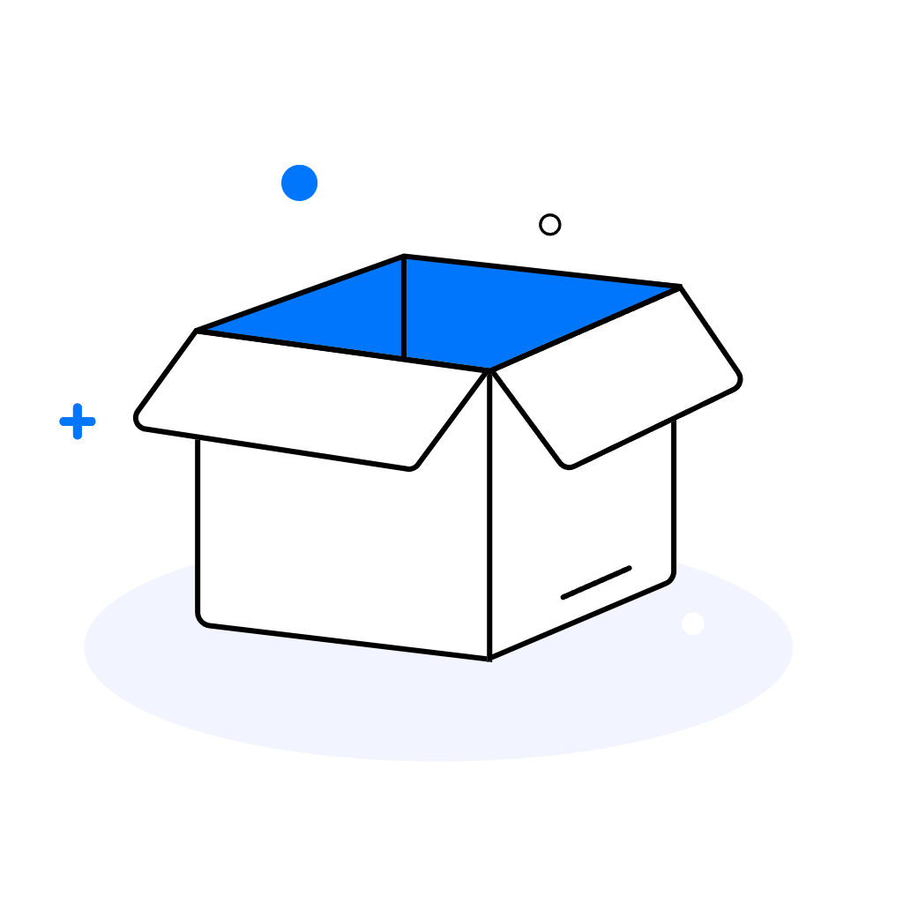

# Nmodm - Modern Game Management Tool

<div align="center">



**A Modern Game Management Tool for Elden Ring: Nightreign**

[](https://python.org)
[](https://pyside.org)
[](LICENSE)
[](https://windows.microsoft.com)

English | [中文](README.md)

</div>

## 📖 Overview

Nmodm is a modern game management tool designed specifically for Elden Ring: Nightreign. It integrates mod management, LAN multiplayer, tool downloads, and configuration management, providing players with a one-stop solution for enhancing their gaming experience.

🔗 **Nexus Mods**: [Nightreign Mod Manager](https://www.nexusmods.com/eldenringnightreign/mods/274)

## ✨ Key Features

- 🎮 **Game Management** - Auto-detect game path, one-click launch configuration
- 🔧 **ME3 Integration** - Auto-download and manage ME3 mod tools
- 🎯 **Smart Mod Management** - Auto-identify mod types, real-time config generation
- 🌐 **LAN Multiplayer** - Virtual LAN solution based on EasyTier
- 🎨 **Modern UI** - Frameless design, sidebar navigation, real-time status

## 🚀 Quick Start

### Download and Use (Recommended)

1. Visit [Releases](../../releases) to download the latest version
2. Extract to any directory (English path recommended)
3. Double-click `Nmodm.exe` to launch

### Run from Source

```bash
# Clone repository
git clone https://github.com/your-repo/Nmodm.git
cd Nmodm

# Install dependencies
pip install -r requirements.txt

# Run application
python main.py
```

## 💻 System Requirements

- **OS**: Windows 10/11 (64-bit)
- **Python**: 3.8+ (for running from source)
- **Memory**: 4GB RAM (8GB recommended)
- **Dependencies**: Visual C++ Redistributable 2015-2022, .NET Framework 4.7.2+

## 📚 Documentation

- 📖 [User Guide](docs/en/USER_GUIDE.md)
- 🔧 [Developer Guide](docs/en/DEVELOPER_GUIDE.md)
- 📊 [Changelog](docs/en/CHANGELOG.md)
- 🤝 [Contributing Guide](docs/en/CONTRIBUTING.md)

## 🛠️ Tech Stack

- **UI**: PySide6 (Qt6)
- **Language**: Python 3.8+
- **Packaging**: Nuitka, PyInstaller
- **Integrated Tools**: ME3, EasyTier, OnlineFix

## 🤝 Contributing

Issues and Pull Requests are welcome! See [Contributing Guide](docs/en/CONTRIBUTING.md)

## 📄 License

This project is licensed under the [MIT License](LICENSE)

## 🙏 Acknowledgments

- [ME3 Project](https://me3.readthedocs.io/) - Mod management tools
- [PySide6](https://pyside.org/) - GUI framework
- [EasyTier](https://github.com/EasyTier/EasyTier) - Virtual LAN solution
- Thanks to all contributors and community support

---

<div align="center">

**⭐ If this project helps you, please give it a Star!**

[](../../stargazers)
[](../../network/members)

*"In the world of Nightreign, let technology empower your adventure"*

</div>
